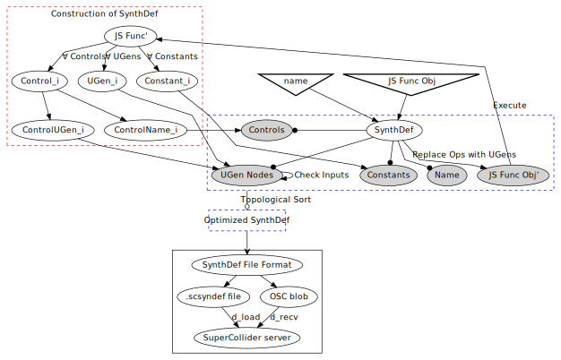

# SynthDefJS
[SynthDefJS](https://github.com/jackkilgore/synthdefjs) is a JavaScript library for defining audio graphs compliant with the [SuperCollider](https://github.com/supercollider/supercollider) audio server. It follows from SuperCollider's own [SynthDef construct](http://doc.sccode.org/Classes/SynthDef.html) and aims to support all [UGens](http://doc.sccode.org/Classes/UGen.html) available to the SuperCollider language. The hope is that this can be a library that covers [SuperColliderJS's](https://crucialfelix.github.io/supercolliderjs/#/) inability to define SynthDefs in JavaScript.

## What You Need to Know to Use SynthDefJS

SynthDefJS allows users to express audio graphs through canocial JavaScript function that contains instantiations and connections of [UGen objects](http://doc.sccode.org/Classes/UGen.html). All UGens follow the form: `UGenClass.rate(args...)` where the domain of `rate` is some element of the power set of `{ar, kr, ir}`. See the [SupeCollider documentation on UGens](http://doc.sccode.org/Guides/Tour_of_UGens.html) for examples. The way in which UGens are connected follows from the [SynthDefs in SuperCollider](http://doc.sccode.org/Guides/Tour_of_UGens.html). This is best seen through a simple example that describes a sine wave that is sent to an audio output.
```JavaScript
let sc = require("synthdefjs")

let def0 = SynthDef('def0', () => {
	let sig = SinOsc.ar(220, 0)
    Out.ar(0, sig)
}).writeToFile(
```

If someone would like to dynamically change aspects of a `SynthDef` after it has been sent to the audio server, SynthDefJS allows users to specify paramters using a **named control** style. A **named control** style is defined as follows: `'parameter name'.rate(default_value)` where `rate = ar | kr | ir`.

An example using the **named control** style:
```JavaScript
// FM Synth -- Nice
let sc = require("synthdefjs")

let def1 = sc.SynthDef('def6', () => {
	let mod = sc.SinOsc.ar('m_freq'.kr(1))
	mod = sc.MulAdd(mod, 'width'.kr(10), 'c_freq'.kr(220))
	let carrier = sc.SinOsc.ar(mod)
	carrier = sc.BinOp('*', carrier, 'amp'.kr(0.5))
	sc.Out.ar(0, carrier)
})
```

We can also perform multi-channel expansion by passing arrays of arguments to UGens. Here is the previous mono FM example turned into a stereo FM:
``` Javascript
// Stereo FM Synth -- Nicee
let sc = require("synthdefjs")

let def1 = sc.SynthDef('def6', () => {
	let mod = sc.SinOsc.ar('m_freq'.kr(1))
	mod = sc.MulAdd(mod, 'width'.kr(10), 'c_freq'.kr(220))
	let carrier = sc.SinOsc.ar(Array(2).fill(mod)) // Duplicate 'mod' param propgate it through the synth.
	carrier = sc.BinOp('*', carrier, 'amp'.kr(0.5)) 
	sc.Out.ar(0, carrier)
})
```

Once defined, a `SynthDef` returns a data structure that can be easily formatted for use with a SuperCollider audio engine. A compliant format can be outputted to a file like so: 
```Javascript
sc.SynthDef('name', () => {...}).writeDefFile(/path/to/synth.scsyndef)
```  
Or it can be turned into a byte array that is ready to be send to a SuperCollider audio server:
```Javascript
our_synth = sc.SynthDef('name', () => {...}).outputBytes()
```

## What is Going On?

`SynthDef(.)` works by executing its passed function (second argument), call it *JS Func Obj*. Whenever *JS Func Obj* encounters a **UGen** or **Named Control** it stores a signature of that object in some data structure. This data structure is then converted to a compact representation of an audio graph following the [SynthDef file format](http://doc.sccode.org/Reference/Synth-Definition-File-Format.html). This can be visualized like so:



## Experimental Features

### Using Babel to Hack Together Operator Overloading 
Notice that in the FM Synth example we are forced to use `sc.MulAdd(.)` and `sc.BinOp(.)` when we want to perform math operations on UGens. This is verbose and annoying; it would be more preferrable to just do something like this: 
```JavaScript
// FM Synth using Operator Overloading -- Even Nicer
let sc = require("synthdefjs")

let def2 = sc.SynthDef('def2', () => {
	let mod = sc.SinOsc.ar('m_freq'.kr(1)) * 'width'.kr(10) + 'c_freq'.kr(220)
    let carrier = sc.SinOsc.ar(mod) * 'amp'.kr(0.5)
    sc.Out.ar(0, carrier)
})
```
SynthDefJS is making progress towards the above syntax by dynamically converting arithmetic operations within a SynthDef function into BinOps or BinOp variants using Babel. Unfortunately, this is fragile and poses security risks (it makes the use of `eval(.)` unavoidable). Thus, this is an experimental feature that will continue to improve and will be made optional for any users of the library. 

For details see `experimental/SynthDefBabel.js`

## Dependencies
- ECMAScript6
- babel/core7 (experimental)
- babel/plugin-transform-arrow-functions (experimental)
- acron (experimental)

## Hopes and Dreams
- [ ] Topological sorting of the audio graph
- [ ] Graph-aware optimizations of `BinOp(.)`
- [ ] `add(.)` method that sends an OSC blob to a running SuperCollider server
- [ ] Dynamic, robust operator overloading
- [ ] Multi-output UGen support
- [ ] Implement all [SuperCollider UGens](http://doc.sccode.org/Guides/Tour_of_UGens.html)
- [ ] Rewriting in TypeScript to better comply with [SuperColliderJS](https://crucialfelix.github.io/supercolliderjs/#/)
